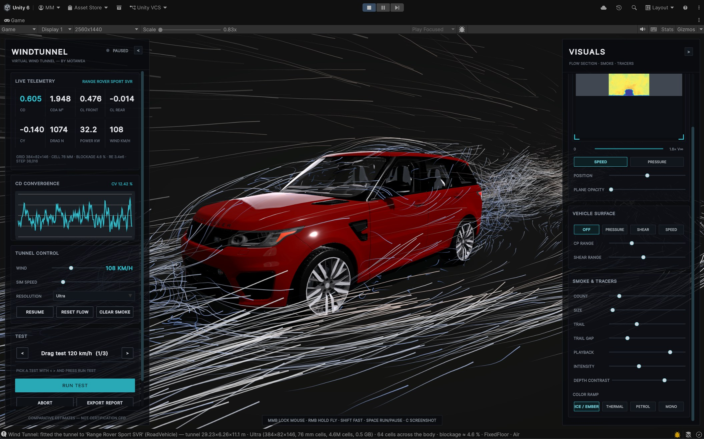
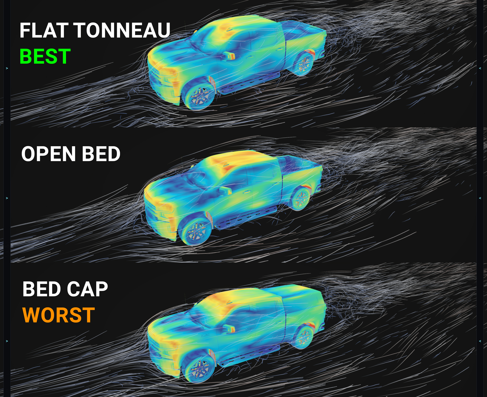
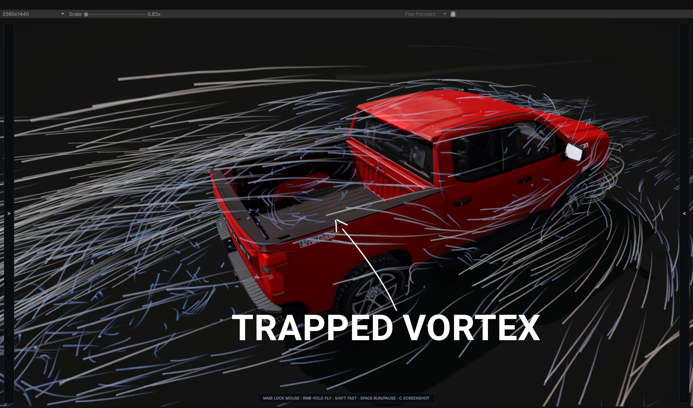
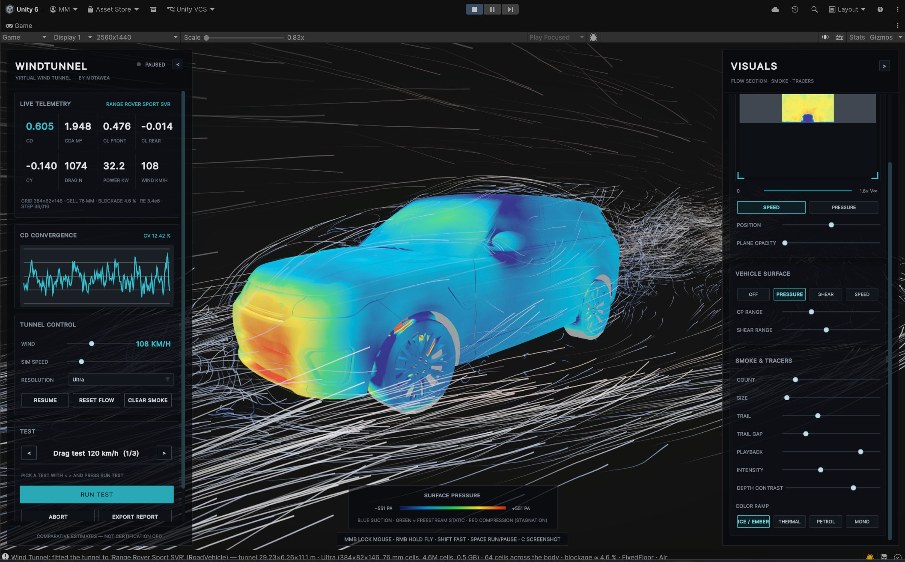
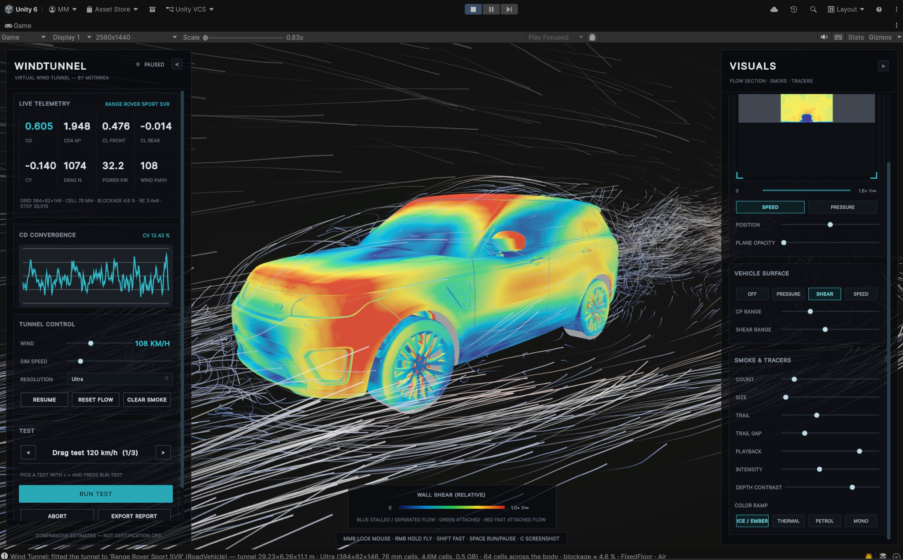
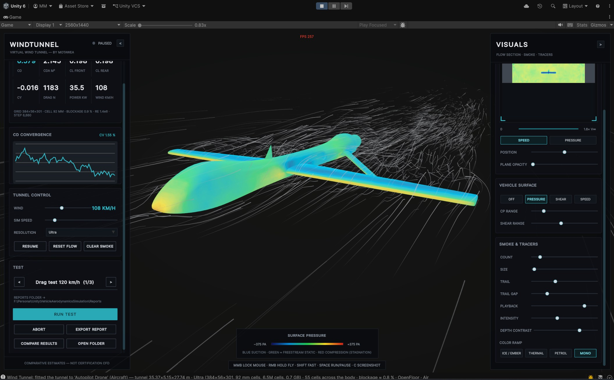
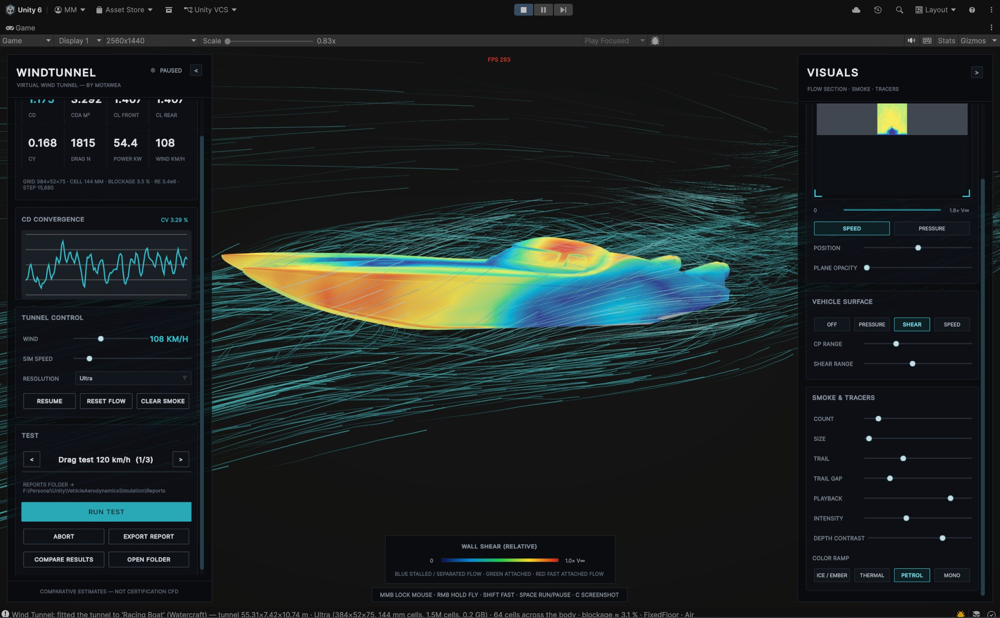
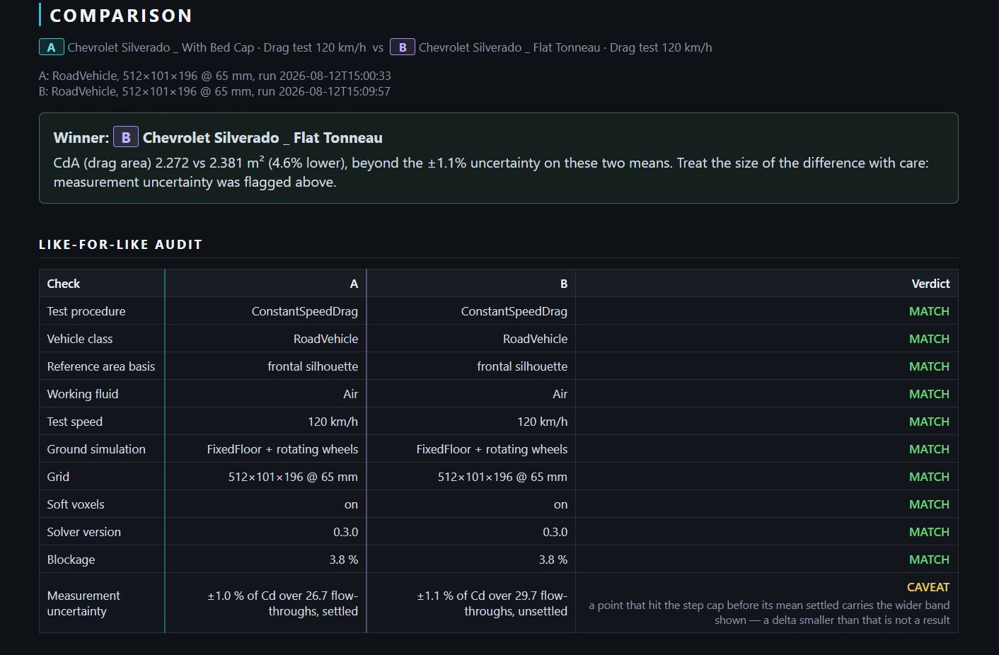
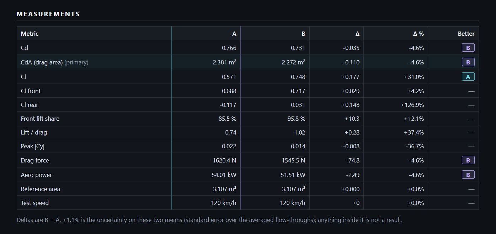
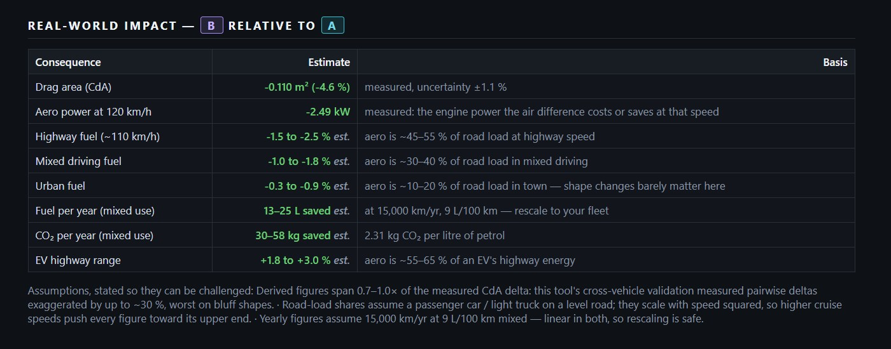

# Unity Wind Tunnel

GPU lattice-Boltzmann (LBM) wind tunnel for vehicle aerodynamics inside Unity 6 / URP.
Drop a vehicle into a tunnel domain and get industry-style outputs: **Cd, CdA, front/rear
lift split (aero balance), Cy**, yaw sweeps, ride-height sweeps, fixed-floor vs rolling-road
ground simulation, smoke-particle flow visualization, a live UI Toolkit dashboard and
HTML/CSV reports.

*The sample scene at Ultra — 384×82×146 cells at 76 mm, 4.6 % blockage. The fine print
under the telemetry tiles is how you tell whether the numbers above it are worth anything.*

> ⚠️ **What this is (and isn't).** This is a *design-exploration, comparison and
> education* tool. The flow solver is a real CFD method (D3Q19 LBM, TRT collision with
> WALE LES, the same family as commercial automotive tools), but it runs at interactive
> grid resolutions with under-resolved boundary layers (no wall model). Use it to compare
> variants and communicate flow behavior — **not** as a substitute for validated CFD or
> physical wind-tunnel measurement. See [Validation status](#validation-status) for exactly
> how far the numbers go.

## Run the demo

Open **`Assets/Scenes/SimulationScene.unity`** and press **Play**. The Range Rover spawns,
the tunnel auto-fits around it, the solver starts, and the console comes up over the view.

Press the **number keys to swap vehicles**. A swap is not just an `Instantiate` — it aborts
whatever test was running, re-voxelizes the new body, re-fits the tunnel around it and
restarts the flow, because the domain that suited the last vehicle is wrong for this one.

| Key | Vehicle | Class | Why it's in the demo |
|---|---|---|---|
| **1** | Range Rover Sport SVR | Road vehicle | Large SUV: the high-blockage, high-drag baseline. Spawns on Play. |
| **2** | Autopilot Drone | Aircraft | Free-air class — no ground plane, wing-planform reference area, scored on L/D. |
| **3** | Racing Boat | Watercraft | Above-waterline mode: the waterline *is* the tunnel floor, and only what's above it is in the flow. |
| **4** | Chevrolet Silverado — open bed | Road vehicle | Bed comparison, variant 1 of 3. |
| **5** | Chevrolet Silverado — bed cap | Road vehicle | Variant 2 — same truck, closed bed. |
| **6** | Chevrolet Silverado — flat tonneau | Road vehicle | Variant 3 — same truck, flat cover. |

Slots **4–6 are the point of the demo**: one vehicle, one grid, one setting changed. That is
the kind of delta this tool is honest about — read [Validation status](#validation-status)
before you trust any absolute number it prints. Those three import from `.blend` and need
Blender installed (see [Requirements](#requirements)); slots 1–3 do not.

*Keys 4, 5 and 6 at the same grid, same 120 km/h drag test — and the ranking is not the one
most people guess. Read it as what this tool measured on this grid, not as a fact about
pickup trucks: [Validation status](#validation-status) is specific about which deltas
survive scrutiny.*

*The other half of the answer. Coefficients tell you a bed configuration costs drag; the
tracers show you the vortex parked in the bed that is doing it. Flow visualization is the
one output that stays trustworthy at every resolution.*

The Molnia concept racer ships in `Assets/Prefabs/OtherVehicles/` but is not wired to a
hotkey — add it to the spawner if you want it (see
[Save it as a prefab and add it to the spawner](#6-save-it-as-a-prefab-and-add-it-to-the-spawner)).

### Camera and hotkeys

| Input | Action |
|---|---|
| **1**–**6** | Swap the vehicle under test. Keys 1–9 map to spawner slots 1–9. |
| **Middle mouse** | Toggle mouse lock — free-look stays on until you press it again. |
| **Right mouse** (hold) | Temporary free-look while the cursor is free. |
| **WASD**, **Q** / **E** | Move while looking; Q down, E up. |
| **Shift** | Fast move. |
| **Scroll** | Dolly forward/back. While flying, tunes the move speed instead. |
| **Space** | Run / pause the solver. |
| **C** | Screenshot — pauses the sim, writes a PNG and opens the folder. |
| **F2** | FPS readout, top-center. |
| **Esc** | Closes the comparison window. |

The hint bar along the bottom of the screen lists the camera keys and updates to match the
mouse-lock state. It does not list the vehicle keys — that is what the table above is for.

## Quick start

Setting up your *own* vehicle in your *own* scene — for the sample scene, see
[Run the demo](#run-the-demo) above.

1. **GameObject → Wind Tunnel → Sample Test Vehicle** — or bring your own model, which
   takes a few more steps: see [Adding your own vehicle](#adding-your-own-vehicle).
2. Set the vehicle's **class** on the `AeroVehicle` component — road vehicle,
   motorsport, aircraft, watercraft or reference body. Everything else follows from it.
   Give it a **display name** too, or reports and file names will call it whatever the
   imported asset was called.
3. **GameObject → Wind Tunnel → Tunnel** — creates the tunnel domain, a smoke rake and
   a flow-slice plane, **fits the tunnel to the vehicle**, queues the standard test
   procedures for its class, and opens the dashboard.
4. Point the vehicle's **nose toward the tunnel's local −X** (wind blows along +X).
5. In the **Wind Tunnel Dashboard** (Window → Wind Tunnel → Dashboard), press **Free run** —
   works in edit mode (the dashboard window drives the solver) and in play mode.
6. Press **Run all tests**, then **Export report** (HTML + CSV + JSON archive).
7. **Window → Wind Tunnel → Compare Results** (or **COMPARE RESULTS** in the runtime HUD)
   to difference two exported sessions.

## The runtime console

The in-game console drives the same tunnel and test runner the editor dashboard does, so
anything below can also be done from **Window → Wind Tunnel → Dashboard** without entering
play mode. Either panel folds away with the **`<`** / **`>`** tab in its header.

### Left panel — measurement

**LIVE TELEMETRY** — Cd, CdA, front and rear Cl, Cy, drag force in newtons, aerodynamic
power in kilowatts and the wind speed the numbers were taken at, for whichever vehicle is
in the tunnel. The fine print underneath is the line that tells you whether to believe them:
grid dimensions, cell size, **blockage ratio** (over 7.5 % and the results read high — see
[Engineering conventions](#engineering-conventions)), effective Reynolds number, and solver
step count.

**CD CONVERGENCE** — Cd against time, with the live coefficient of variation beside the
title. The status light reads `STANDBY` → `RUNNING` → `CONVERGED`, where converged means the
*mean* has settled inside its own uncertainty — not that the wake stopped moving. A bluff-body
wake never stops moving.

**TUNNEL CONTROL**

| Control | What it does |
|---|---|
| **WIND** | Freestream speed, 30–250 km/h. Applied on release rather than during the drag, and it restarts a live run: changing speed re-derives the lattice unit mapping. |
| **SIM SPEED** | Solver steps per rendered frame, 1–128. A speed/interactivity trade only — it buys simulated time per second, and changes nothing about the physics. |
| **RESOLUTION** | `Coarse` → `Extreme`. Choosing a tier by hand **turns the auto-fit's automatic resolution off**, so the next vehicle swap can't silently revert you; the grid rebuilds immediately if the tunnel is running. Never compare two runs across different tiers. |
| **PAUSE** / **RESUME** | Freezes the solver with the flow field intact. |
| **RESET FLOW** | Clears the field back to freestream and starts the averaging over. |
| **CLEAR SMOKE** | Empties the tracer rakes. |

**TEST**

- **`<`** / **`>`** page through the queue the vehicle's class was given — for a road car:
  drag at 120 km/h, a ±15° yaw sweep, and a ride-height sweep. Changing the selection aborts
  any run and resets the flow, so the next test starts from a clean field rather than the
  tail of the last one.
- **RUN TEST** runs the *selected* test as a one-test session. The editor dashboard's
  **Run all tests** runs the whole queue; the progress bar and status line track either.
- **ABORT** stops the session and restores the vehicle's pose and reference area.
- **EXPORT REPORT** writes HTML + CSV + a `.windtunnel.json` archive for the last
  **completed** session, and highlights itself when one is waiting. Free-running telemetry is
  not a session — there is nothing to export until a test finishes.
- **COMPARE RESULTS** opens the comparison view — see [Comparing results](#comparing-results).
- **OPEN FOLDER** shows where exports land: `<project>/Reports` in the editor,
  `Application.persistentDataPath/Reports` in a build. Screenshots go to `Screenshots/`
  alongside it.

### Right panel — visualization

**FLOW SECTION — SCANNER** — a slice plane sampled straight out of the solver's 3D field
into the panel image; there is no second camera involved. **SPEED** maps |u| as a ratio of
freestream up to 1.6× V∞, **PRESSURE** maps Cp. **POSITION** slides the plane through the
tunnel and **PLANE OPACITY** fades the quad drawn in the world, so you can read the scanner
without the plane covering the car.

**VEHICLE SURFACE** — paints the body itself rather than the air around it:

| Mode | Shows |
|---|---|
| **PRESSURE** | Surface Cp — stagnation at the nose, suction over the roof and screen. |
| **SHEAR** | Wall-shear pattern: where the flow is still attached and where it has let go. |
| **SPEED** | Flow speed just off the surface. |
| **OFF** | Restores the vehicle's original materials. |

**CP RANGE** and **SHEAR RANGE** set the colour scale — narrow them to pull detail out of a
flat-looking body. A colour key appears bottom-center while a mode is active.

*`PRESSURE` — the key reads in pascals: blue suction, green near freestream static, red
compression at the stagnation points.*

*`SHEAR` — blue is stalled or separated flow, green attached, red fast attached flow. This is
the view that shows you where the body loses the flow, which is the thing the drag number
alone can never tell you.*

**SMOKE & TRACERS** — GPU tracer rakes advected through the solved velocity field:
**COUNT** (4k–262k particles), **SIZE**, **TRAIL** length, **TRAIL GAP**, **PLAYBACK** speed,
**INTENSITY**, **DEPTH CONTRAST**, and four colour ramps (ICE / EMBER, THERMAL, PETROL, MONO).
Tracers read the same field the forces are integrated from, but nothing in a report depends
on them — they are for seeing and explaining the flow, not for measuring it.

## Vehicle classes

The class on `AeroVehicle` is the one setting that has to be right; it decides the rest:

| Class | Ground | Wheels | Reference area | Placement | Better lift |
|---|---|---|---|---|---|
| `RoadVehicle` | fixed floor | rotating | frontal silhouette | contact patches on the floor | lower |
| `Motorsport` | fixed floor | rotating | frontal silhouette | contact patches on the floor | lower (downforce) |
| `Aircraft` | none (free air) | — | **wing planform** | centred in the domain | higher (scored on L/D) |
| `Watercraft` | see below | — | frontal silhouette | waterline on the floor | not scored |
| `ReferenceBody` | none (free air) | — | frontal silhouette | centred in the domain | not scored |

*`Aircraft` (demo key 2): no floor, the body centred in the cross-section, coefficients
divided by wing planform rather than frontal silhouette, and the tunnel refitted around a
35 m span — all of it decided by the one class field.*

**Watercraft** has two modes, because the solver has no free surface:

- `AboveWaterlineAir` — the waterline becomes the tunnel floor and only the
  superstructure above it is in the flow, in air. This is how ship and boat wind loads
  are measured in a real wind tunnel, so the numbers mean what they say.
- `SubmergedHull` — the whole hull in water (density and viscosity from standard
  temperature fits, fresh or sea). Gives pressure and friction drag but **no
  wave-making resistance**, which dominates real planing-hull power — treat it as a
  comparative hull-shape tool only.

*`Watercraft` in `AboveWaterlineAir` (demo key 3). The hull still renders whole, but the
waterline is the tunnel floor — only what sits above it is in the flow, which is exactly how
a real tunnel measures a boat.*

## Adding your own vehicle

### 1. Import the model

Drop the model anywhere under `Assets/`. Three things decide whether it can be tested at
all:

- **Unity units are metres.** Every coefficient divides by a projected area in m², and the
  auto-fit sizes the tunnel from the body's bounds — so a car imported at 100× scale gets a
  100× tunnel and a meaningless CdA. Fix the scale on the model importer, not the transform.
- **Enable Read/Write** on the model importer. The editor can voxelize a non-readable mesh
  anyway, so this looks fine until you make a build, where the mesh is silently skipped and
  the car becomes partly or wholly invisible to the flow. The spawner logs an error when it
  sees one.
- **Geometry must be on `MeshFilter`s.** The voxelizer ignores `SkinnedMeshRenderer`s
  entirely; if the model is rigged, bake it to plain meshes.

### 2. Set up the root

Add **`Wind Tunnel ▸ Aero Vehicle`** to the model's root. Everything under that root is
voxelized, so the root should contain the body and nothing else.

| Field | What it does |
|---|---|
| **Display name** | What reports, exported file names and the HUD call it. Leave it empty and everything says `range-rover-sport-svr-2022`. |
| **Vehicle class** | The one setting that has to be right — see [Vehicle classes](#vehicle-classes). It drives the ground condition, wheel rotation, reference-area convention and how the auto-fit seats the body. |
| **Reference area mode** | `Automatic` follows the class (frontal silhouette for ground and marine bodies, wing planform for aircraft). Set `Manual` + **Reference area override** when you need coefficients normalised against a published area so your numbers are comparable with someone else's. |
| **Turntable pivot** | Optional. Yaw sweeps rotate about this; defaults to the centre of the bounds projected to the ground. |
| **Waterline** | Watercraft only — `Waterline from keel (m)`, or a child transform as **Waterline marker**. |

### 3. Tag the wheels

Add **`Wind Tunnel ▸ Aero Wheel`** to each wheel. This does two jobs: it applies the
rotating-wall boundary condition, and it locates the axles for the front/rear lift split —
so a road vehicle with fewer than two tagged wheels reports no aero balance at all.

**The spin axis is the wheel's local X (right).** Leave **radius** and **width** at 0 and
they are measured from renderer bounds, which is right most of the time. Each wheel draws
a gizmo in the scene view showing the exact cylinder the voxelizer will carve plus a
rolling-direction arrow — if that cylinder doesn't sit on the tyre, fix it here rather than
finding out from a wrong lift split later.

### 4. Exclude everything that isn't the body

Sketchfab and similar models often ship with a display base, backdrop or full interior.
All of it voxelizes and all of it changes the answer. Put **`Wind Tunnel ▸ Aero Ignore`**
on any such object and it and its children drop out of voxelization.

### 5. Orientation

Point the vehicle's **nose toward the tunnel's local −X** — wind blows along +X. Getting
this wrong doesn't error; it just measures the car backwards.

### 6. Save it as a prefab and add it to the spawner

Save the configured vehicle as a prefab (the samples live in `Assets/Prefabs/Cars/`).
Author the `AeroVehicle` and `AeroWheel` components **on the prefab** — the spawner will
add a bare `AeroVehicle` at runtime if one is missing, but then the wheels and reference
area aren't authored with the model and it warns you about exactly that.

Then select the **CarSpawner** object in `SimulationScene` and add the prefab to its
**Cars** list:

| Field | Notes |
|---|---|
| **Cars** | Order is hotkey order. **Number keys 1–9 map to list entries 1–9**; entries past the ninth still work via `Spawn(index)` but get no hotkey. |
| **Spawn on start** | **Zero-based** — `0` is the first car in the list, so it is off by one from the hotkeys. Set it negative to start with an empty tunnel. |
| **Auto start simulation** | Re-voxelizes and restarts the solver after each swap. Off leaves the tunnel idle until you start it. |
| **Tunnel** / **Runner** | Auto-found in the scene when left empty. |

> Adding or removing a car **renumbers everything below it**. If you insert one above the
> car **Spawn on start** points at, update that index too — otherwise the tunnel boots up
> testing a different vehicle than you think.

Swapping a car is not just an `Instantiate`: the spawner aborts any running test queue,
stops the solver, re-points the tunnel at the new `AeroVehicle`, and re-fits the tunnel
around it — because the domain that was right for the last body is wrong for this one.

### If something looks wrong

| Symptom | Cause |
|---|---|
| `no readable MeshFilter geometry to voxelize` | Read/Write is off, or the geometry is on `SkinnedMeshRenderer`s. |
| Car renders but measures nothing | The `AeroVehicle` isn't on an ancestor of the mesh, or an `AeroIgnore` is too high up the hierarchy. |
| Absurd tunnel size, or a blockage-ratio warning | Model isn't in metres, or a display base is still being voxelized. |
| No front/rear lift split | Fewer than two `AeroWheel`s tagged — the split needs at least two axle stations. |
| Right shape, wrong numbers | Nose isn't pointing down −X. |

## Tunnel auto-fit

The tunnel sizes itself around whatever vehicle is under test — a domain built for an
SUV reports blockage-inflated numbers for a drone. Press **Fit tunnel to vehicle** on
the domain (or let a vehicle swap do it), and the fit:

- measures the body along the tunnel axes and lays out clear air in **body extents**:
  1.5–2 lengths upstream, 3.5–4 downstream (the wake needs the room, the inlet does
  not), 2 widths each side, 2–2.5 heights above;
- **enlarges the cross-section** until the frontal area is at most the blockage target
  (default 5%, tighter than the 7.5% warning so a yaw sweep still has headroom);
- **seats the vehicle**: contact patches or waterline on the tunnel floor, or centred
  in the cross-section for free-air classes, laterally centred, at the upstream margin;
- pins the tunnel floor to the scene's visible ground plane, so the simulated floor and
  the floor you can see are the same plane;
- picks the **finest resolution tier that fits a GPU memory budget** (default 2 GB at
  ~190 bytes/cell) and reports the cell size and how many cells span the body;
- re-aims the smoke rakes and the slice plane at the fitted body.

A tunnel that has never been fitted is never re-fitted implicitly — hand-built domains
(validation rigs, the reference-body harness) keep exactly the geometry they were given.

## Comparing results

Every export writes a `.windtunnel.json` archive next to the HTML and CSV, carrying the whole
test configuration — that archive is what the comparison reads. Since the tool's honest output
is a *delta*, this is the feature most of the workflow is aimed at.

### Using it

Open it with **COMPARE RESULTS** in the runtime console or
**Window → Wind Tunnel → Compare Results** in the editor.

1. **Produce two runs.** Run a test, **EXPORT REPORT**, change exactly one thing — swap the
   vehicle with a number key, or move one setting — run the same test again and export again.
   In the demo scene, keys **4**, **5** and **6** are three runs built for this.
2. **Pick the two runs.** The **RESULT A** and **RESULT B** columns list every archive in the
   reports folder. Each side has its own test dropdown, so two sessions that ran different
   queues can still be compared on the test they share.
3. **Read the verdict banner** — the winner, `TOO CLOSE TO CALL`, or `CANNOT COMPARE` with the
   reason it refused.
4. **Read the like-for-like audit** before the numbers. Every check is marked `MATCH`,
   `NOTED`, `CAVEAT` or `BLOCKS COMPARISON`, with the values from each side that earned it.
5. **Read the metric table**: A, B, Δ, Δ % and which side is better *by that metric's polarity*
   for the class involved. Sweeps get a second table comparing point by point.
6. **EXPORT COMPARISON** writes the whole audit to its own HTML file. **REFRESH** re-reads the
   folder — use it after exporting a new run with the window open. **CLOSE** or **Esc** dismisses.

*The verdict never arrives on its own. It carries the delta, the uncertainty band it had to
beat, and — here — the caveat that one of the two runs never settled.*

*Cd, CdA, the lift split, drag force and aero power, each with Δ, Δ % and which side wins on
that metric. Note that reference area and test speed are in the table too: if they differ,
the comparison is not the one you think it is.*

### What the audit does before it differences anything

- **Blocks** the comparison only when the two runs do not measure the same quantity:
  different test procedure, working fluid, or reference-area convention (a car's frontal
  silhouette against a wing's planform). A road car against a race car is *not* blocked —
  same convention, same objective for drag — it is flagged, and lift is left unscored
  because the two classes want it to move in opposite directions.
- **Caveats** differences that bias it: grid resolution, soft-voxel state, package
  version, test speed, ground simulation, high blockage, unconverged points. The
  verdict repeats the caveat rather than burying it.
- Scores each metric by the polarity its class implies, and reports a delta smaller
  than the **uncertainty on the two means** as **"too close to call"** instead of naming
  a winner — the difference between an engineering result and noise. (The band is the
  standard error, not the raw sample scatter: averaging is precisely what buys the
  resolution to see a small difference, and judging against scatter would throw it away.)

### Real-world impact

When a delta survives the audit, the exported comparison ends with a **Real-world impact**
table that translates it: the aero power the difference costs or saves at test speed, then
highway, mixed and urban fuel percentages, litres and CO₂ per year, and EV highway range.
Every row prints the basis it was derived from, and the assumptions behind all of them are
printed underneath so they can be argued with rather than taken on trust.

*Only two rows are measured; the rest are marked `est.` and span 0.7–1.0× of the measured
CdA delta, because this tool's own cross-vehicle validation found pairwise deltas
exaggerated by up to ~30 %.*

If the drag-area difference lands **inside** the measurement uncertainty, the section
derives nothing at all and says so — *no claim* — rather than turning noise into a fuel
saving. That refusal is the point of the feature.

Two runs auto-fitted to *different* vehicles land on different cell sizes, because each
domain is scaled to its own body — which the audit then has to flag. Set
`AutoFitSettings.matchCellSizeM` on both to lock a shared cell size and the caveat goes
away honestly, by making the runs genuinely like-for-like rather than by ignoring it.

## Requirements

- Unity 6000.0+ with compute-shader support (discrete GPU with ~2–4 GB VRAM recommended;
  use the Coarse preset on smaller GPUs). Resolution tiers set the streamwise cell count:
  Coarse 128 / Medium 192 / Fine 256 / Ultra 384 / Extreme 512, with the other two axes
  following the tunnel's aspect ratio at the same cell size — so a *wider* tunnel costs
  memory just as fast as a finer one.
- Meshes under the `AeroVehicle` root should be Read/Write enabled for use in builds
  (the editor can always read them).
- Closed-ish geometry voxelizes best; the outside flood fill tolerates small gaps.
- **Blender is required for one of the sample vehicles.** The Chevrolet Silverado is
  supplied as a `.blend` file, and Unity imports that format by invoking a local Blender
  install. Without Blender on the machine it imports as an empty GameObject and its three
  prefabs render nothing — the tunnel itself is unaffected, and every other sample vehicle
  ships as `.glb` or `.fbx` and needs no extra software. If you would rather not install Blender,
  the unmodified Sketchfab FBX is still in the repo at
  `Assets/Models/2019 Chevrolet Silverado Trail Boss Z71/…/source/FINAL_19_MODEL/` and can
  be swapped in, at the cost of re-authoring the three bed variants.

## Components

| Component | Purpose |
|---|---|
| `WindTunnelDomain` | The tunnel: size, resolution, fluid properties, wind speed, ground mode, auto-fit settings. Owns the solver. |
| `AeroVehicle` | Vehicle root marker; **display name**, **vehicle class**, reference-area policy, waterline, turntable pivot. |
| `AeroWheel` | Wheel tag: rotating-wall boundary condition + axle stations for lift split. |
| `AeroTestRunner` | Queue of test procedures (drag / yaw sweep / ride-height sweep). |
| `FlowParticles` | GPU smoke rake advected through the solved velocity field. |
| `FlowSlice` | Movable velocity / pressure-coefficient heatmap plane. |
| `SurfaceHeatmap` | Paints Cp / wall-shear pattern / speed directly onto the vehicle body (materials restored when disabled). |

## Engineering conventions

- Axes follow the tunnel: **+X streamwise, +Y up, +Z lateral** (adapted from SAE
  J670 / ISO 8855 wind axes). Positive Cl = lift (upforce); production cars are typically
  slightly positive, race cars negative.
- Reference area = measured frontal silhouette area (override on `AeroVehicle`). Sweeps
  **lock the area at the zero-yaw pose** for the whole session, per SAE practice —
  otherwise Cd(ψ) divides by a growing silhouette and reads artificially low.
- Blockage ratio is checked against the usual <7.5 % guidance; results at higher blockage
  read high. No blockage correction is applied.
- **A measurement point is a mean, not a reading.** A bluff-body wake never stops
  oscillating (measured: 4.8–5.9% scatter on an SUV at *every* resolution), so each test
  point reports the average over a settling allowance plus an averaging window
  (1.5 + 3 flow-through times by default) together with the **standard error of that
  mean** — divided by flow-throughs rather than samples, since samples inside one
  flow-through are the same eddies passing and are not independent. "Settled" means the
  mean is stable inside its own uncertainty, a criterion an unsteady wake can actually
  meet; the live badge still tracks the instantaneous coefficient of variation plus a
  half-window drift test. Mirrors wind-tunnel averaging practice (cf. SAE J1252).
- Forces come from momentum exchange in **gauge form**, so uniform ambient pressure cancels
  exactly even for a body resting on the ground plane.

## Validation status

**Reference bodies validate.** Measured in free air (12×5×5 m tunnel @ 256, 30 m/s,
averaged over 20 samples after 20 flow-through times):

| Case | Wind Tunnel Cd | Published Cd | ratio |
|---|---|---|---|
| Flat plate, normal to flow | 1.128 | 1.17 | 0.96× |
| Cube, face-on | 0.900 | 1.05 | 0.86× |
| Sphere | 0.645 | ~0.45 | 1.43× |

The plate and cube are **Reynolds-independent** bodies — separation is pinned at the sharp
edge — so they test the numerics without testing the turbulence modelling. Matching them
rules out force-integration, units and reference-area errors.

**Smooth road-car absolute Cd is not trustworthy.** A production SUV reads Cd ≈ 0.82 against
a real ≈ 0.36. This is a *modelling* limit, not noise: on a smooth curved body the separation
line is found by the boundary layer, and the boundary layer is not resolved (no wall model;
at interactive resolutions a cell is thicker than the boundary layer itself), so the flow
separates too early and the wake is too wide. Sphere vs plate in the table above is the same
effect in miniature.

**The grid-convergence study says exactly how far refinement gets you** (five tiers, one
fixed auto-fitted domain, 10 flow-throughs each — `aero_grid_convergence.txt`):

| cell size | 228 mm | 152 mm | 114 mm | 76 mm | 57 mm |
|---|---|---|---|---|---|
| Cd | 1.318 | 1.017 | 0.979 | 0.836 | 0.820 |
| vs real 0.36 | 3.66× | 2.82× | 2.72× | 2.32× | 2.28× |

Drag converges monotonically and is essentially grid-independent by 76 mm (the last step
moves it 1.9 %, inside the ±5 % run-to-run scatter) — **but it converges to ~2.3× the real
value, not to it.** What is left after discretisation error is the missing wall model.
Road-car **lift does not converge at all** across those tiers (0.52, 0.82, 2.28, 0.98, 0.65);
treat absolute Cl on a road car as unusable and rely on front/rear balance trends instead.

**So:**

- ✅ Trust **deltas** between variants run on the same grid, resolution and settings.
- ✅ Trust **trends** — Cd vs yaw, Cd/Cl vs ride height, fixed floor vs rolling road.
- ✅ Trust the **flow visualization** as a diagnostic and communication tool.
- ❌ Don't quote an absolute road-car Cd as an estimate of the real value.
- ❌ Don't compare across resolutions, or across the soft-voxel toggle.

**The Ahmed body says what kind of delta you can trust.** The standard automotive
benchmark is a plain body whose only variable is the rear slant angle; its published drag
swings 51% across the angles below. Ours swings 5%:

| slant | 0° | 25° | 30° | 35° | spread |
|---|---|---|---|---|---|
| measured Cd | 1.082 | 1.034 | 1.071 | 1.029 | **5%** |
| published Cd | ~0.250 | ~0.285 | ~0.378 | ~0.260 | **51%** |

Every angle lands near Cd ≈ 1.0 — the drag of a plain square-backed box. The flow
separates early and stays separated whatever the tail looks like, so the shape that
defines the benchmark never gets to act. That refines the honest claim above:

- ✅ Deltas driven by **size, frontal area and gross bluffness** are real. A separate
  three-vehicle run ranks an SUV, a sports car and a race car in the correct order.
- ❌ Deltas driven by **where the flow separates on a smooth surface** — slant angle,
  roofline rake, tailgate or spoiler treatment — are currently **invisible**. Do not use
  the tool to choose between them until a wall model lands.

Still owed: cylinder cross-flow, sphere re-check with soft voxels tuned. Tracked in
`docs/DESIGN.md`.

## Known limitations

- **No wall model** — the dominant error source for smooth bodies (see above).
- **Uniform grid**, memory ∝ resolution³. Budget ≈ 190 bytes/cell.
- **Gap flow needs ≥ 3 cells.** Measured: a slot passes meaningful flow only with ≥2 fully
  open cell rows; sub-cell gaps pass 1–4 %. F1-scale slot gaps need a zoomed sub-domain.
- **No internal or cooling flow.** Dead-end ducts stagnate; intakes would need a suction BC.
- **`MovingBelt` + rotating wheels** was observed to diverge under the previous (BGK)
  solver and has not yet been re-verified under TRT+WALE — prefer `FixedFloor` until it is.
- **Soft voxels change the answer**: leave them **on** for smooth curved bodies (they
  suppress voxel-staircase roughness) and **off** for sharp-edged reference bodies. Never
  compare across the toggle. A body thinner than half a cell still measures zero frontal
  area (the reference area is floored at one cell so the failure is loud, not silent).
- Far-field walls are forced to freestream — an open-jet idealisation, not a real tunnel
  wall and not a non-reflecting boundary.
- **No free surface.** A submerged watercraft run has no wave-making resistance — the
  dominant term for a real planing hull. Above-waterline (air) mode has no such caveat.
- **Aircraft planform area** is measured from the voxel silhouette, so a wing thinner
  than half a cell contributes nothing to it. Check the reported planform area against
  the real wing area before trusting a lift coefficient.

## Documentation

| Document | What it is |
|---|---|
| [`docs/DESIGN.md`](docs/DESIGN.md) | Design intent: architecture decisions, the physics-core specification, validation status and the cross-file invariants that must stay in step. |
| [`docs/IMPROVEMENT-PLAN.md`](docs/IMPROVEMENT-PLAN.md) | The work queue. Staged, resumable plan for closing the accuracy gap — each stage carries its own context, implementation notes and the measured baseline it must beat. |
| [`docs/validation/`](docs/validation/) | Archived output of the validation harnesses. Every measured number quoted in this README and in `DESIGN.md` comes from one of these runs. |
| [`CHANGELOG.md`](CHANGELOG.md) | Version history. |
| [`THIRD-PARTY-NOTICES.md`](THIRD-PARTY-NOTICES.md) | Model attributions, licences and the trademark notice. |

## Sample vehicles

The sample scene ships five third-party vehicles, every one published under
[CC BY 4.0](https://creativecommons.org/licenses/by/4.0/):

| Vehicle | Author | Source |
|---|---|---|
| 2019 Chevrolet Silverado Trail Boss Z71 | Ddiaz Design | [skfb.ly/p88ox](https://skfb.ly/p88ox) |
| Land Rover Range Rover Sport SVR | Mona x Supercars | [skfb.ly/pznrG](https://skfb.ly/pznrG) |
| Futuristic racing car — "Molnia" | TuppsM | [skfb.ly/6TCWL](https://skfb.ly/6TCWL) |
| Boat | milamila | [skfb.ly/6VKs9](https://skfb.ly/6VKs9) |
| autopilot aircraft / drone | Helindu | [skfb.ly/6SwHV](https://skfb.ly/6SwHV) |

Full attributions, the changes made to each model and the trademark notice are in
[`THIRD-PARTY-NOTICES.md`](THIRD-PARTY-NOTICES.md). CC BY 4.0 requires that attribution
travel with the work, so keep that file intact if you fork or redistribute.

The Chevrolet Silverado imports from `.blend` and therefore needs Blender installed — see
[Requirements](#requirements).

Nothing here is affiliated with or endorsed by any vehicle manufacturer, and no figure this
software produces describes any real vehicle's actual performance.

## License

Source code: **MIT** — see [`LICENSE.md`](LICENSE.md).

The 3D models under `Assets/Models/` are **not** covered by the MIT licence. Each remains
under CC BY 4.0, as listed in [`THIRD-PARTY-NOTICES.md`](THIRD-PARTY-NOTICES.md).
